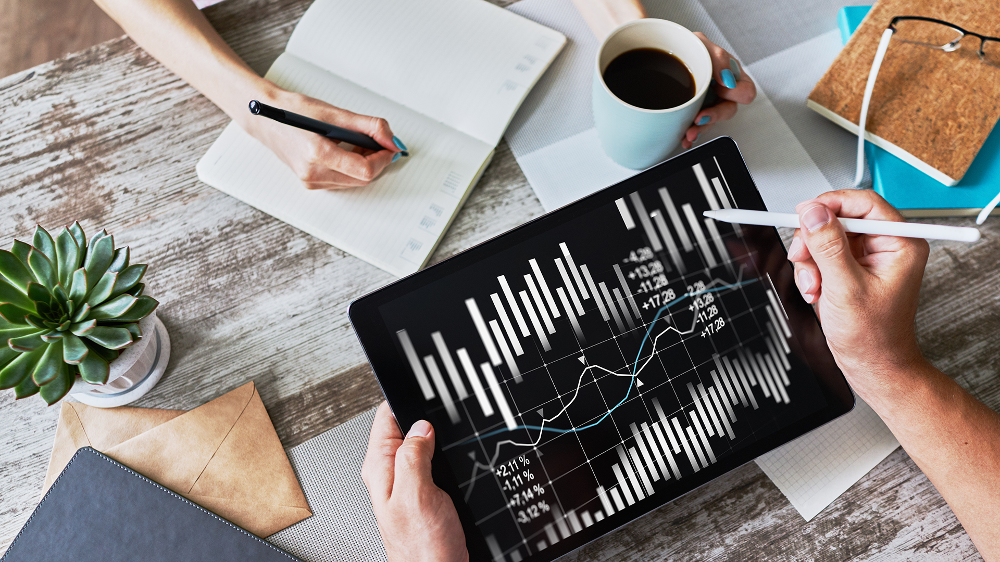

# A Whale Off the Port(folio)

## Background

The investment division of Harold's company has been investing in algorithmic trading strategies. Some of the investment managers love them, some hate them, but they all think their way is best.

You just learned these quantitative analysis techniques with Python and Pandas, so Harold has come to you with a challenge—to help him determine which portfolio is performing the best across many areas: volatility, returns, risk, and Sharpe ratios.

Created a tool (an analysis notebook) that analyzes and visualizes the major metrics of the portfolios across all of these areas, and determined which portfolio outperformed the others. We used historical daily returns of several portfolios: some from the firm's algorithmic portfolios, some that represent the portfolios of famous "whale" investors like Warren Buffett, and some from the big hedge and mutual funds. We will use this analysis to create a custom portfolio of stocks and compare its performance to that of the other portfolios, as well as the larger market (S&P 500).

We will be accomplishing three main tasks:

1. [Read in and Wrangle Returns Data](#Prepare-the-Data)
2. [Determine Success of Each Portfolio](#Conduct-Quantitative-Analysis)
3. [Choose and Evaluate a Custom Portfolio](#Create-Custom-Portfolio)

---

## Instructions

**File:** [Whale Analysis Starter Code](Starter_Code/whale_analysis.ipynb)

### Prepare the Data

First, read and clean several CSV files for analysis. The CSV files include whale portfolio returns, algorithmic trading portfolio returns, and S&P 500 historical prices. Used the [Whale Analysis Starter Code](Starter_Code/whale_analysis.ipynb) to complete the following steps:

1. Used Pandas to read in each of the [CSV files](Starter_Code/Resources) as a DataFrame. We made sure to convert the dates to a `DateTimeIndex`.

2. Detected and removed null values.

3. Removed dollar signs from the numeric values and convert the data types as needed.

4. The whale portfolios and algorithmic portfolio CSV files contain daily returns, but the S&P 500 CSV file contains closing prices. We will convert the S&P 500 closing prices to daily returns.

5. Joined `Whale Returns`, `Algorithmic Returns`, and the `S&P 500 Returns` into a single DataFrame with columns for each portfolio's returns.

  

### Conduct Quantitative Analysis

Analyzed the data to see if any of the portfolios outperform the stock market (i.e., the S&P 500).

#### Performance Analysis

1. Calculated and ploted cumulative returns. Does any portfolio outperform the S&P 500?

#### Risk Analysis

1. Created a box plot for each of the returns. Which box has the largest spread? Which has the smallest spread?

2. Calculated the standard deviation for each portfolio. Which portfolios are riskier than the S&P 500?

3. Calculated the annualized standard deviation (252 trading days).

#### Rolling Statistics

1. Ploted the rolling standard deviation of the various portfolios along with the rolling standard deviation of the S&P 500 using a 21 day rolling window. Does the risk increase for each of the portfolios at the same time risk increases in the S&P?

2. Constructed a correlation table for the algorithmic, whale, and S&P 500 returns. Which returns most closely mimic the S&P?

3. Choose one portfolio and plot a rolling beta between that portfolio's returns and S&P 500 returns. Does the portfolio seem sensitive to movements in the S&P 500?

4. An alternative way to calculate a rolling window is to take the exponentially weighted moving average. This is like a moving window average, but it assigns greater importance to more recent observations. We'll try calculating the ewm with a 21 day half-life.

### Plot Sharpe Ratios

Investment managers and their institutional investors look at the return-to-risk ratio, not just the returns. (After all, if you have two portfolios that each offer a 10% return, yet one is lower risk, you would invest in the lower-risk portfolio, right?)

1. Using the daily returns, calculated and visualize the Sharpe ratios using a bar plot.

2. Determined whether the algorithmic strategies outperform both the market (S&P 500) and the whales portfolios.

### Create Custom Portfolio

Harold is ecstatic that you were able to help him prove that the algorithmic trading portfolios are doing so well compared to the market and whales' portfolios. However, now you are wondering whether you can choose your own portfolio that performs just as well as the algorithmic portfolios. Investigate by doing the following:

1. Visit [Google Sheets](https://docs.google.com/spreadsheets/) and use the in-built Google Finance function to choose 3-5 stocks for your own portfolio.

2. Download the data as CSV files and calculate the portfolio returns.

3. Calculated the returns for each stock.

4. Using those returns, calculated the weighted returns for your entire portfolio assuming an equal number of shares for each stock.

5. Added your portfolio returns to the DataFrame with the other portfolios and rerun the analysis. How does your portfolio fair?

## Our analysis should include the following:

- Using all portfolios:
  - The annualized standard deviation (252 trading days) for all portfolios.
  - The plotted rolling standard deviation using a 21 trading day window for all portfolios.
  - The calculated annualized Sharpe Ratios and the accompanying bar plot visualization.
  - A correlation table.
- Using your custom portfolio and one other of your choosing:
  - The plotted beta. . How does your portfolio fair?

---

## Resources

[Pandas API Docs](https://pandas.pydata.org/pandas-docs/stable/reference/index.html)

---

## Hints

* After reading each CSV file, we sorted each DataFrame in ascending order by the Date using `sort_index`. This is especially important when working with time series data as we want to make sure Date indexes go from earliest to latest.

* Use the Pandas functions.

* We made sure to use `head()` or `tail()` looking at our data to avoid having to print to a large DataFrame.

